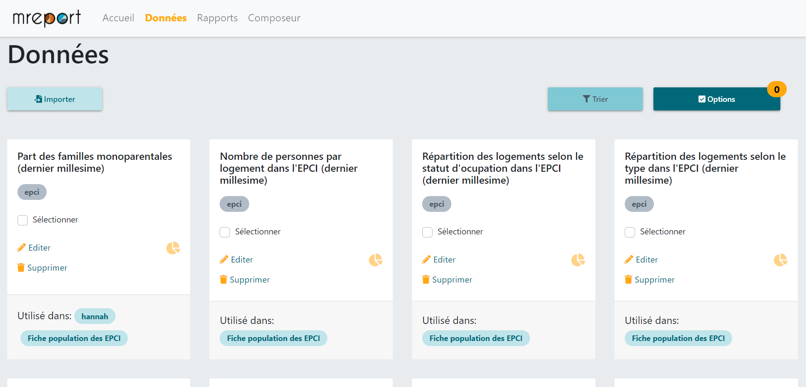
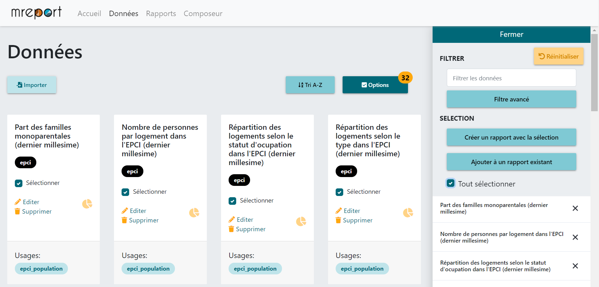
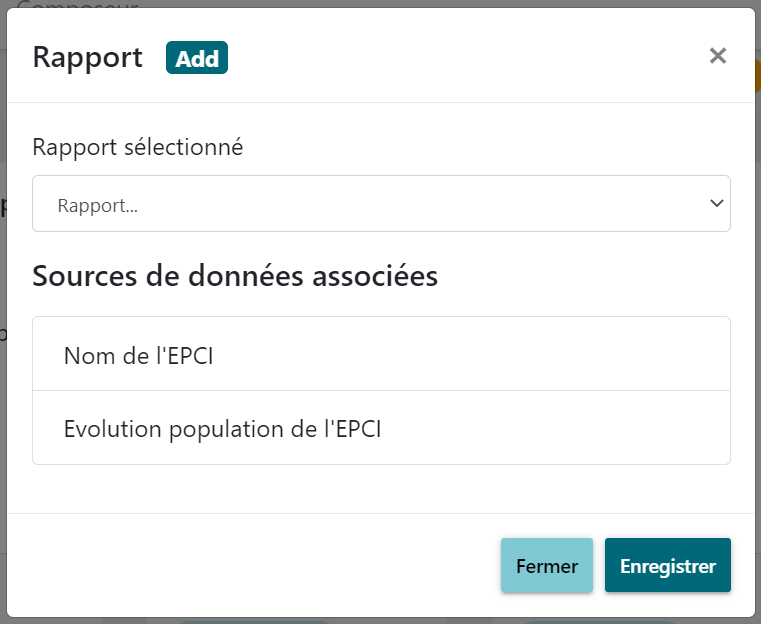
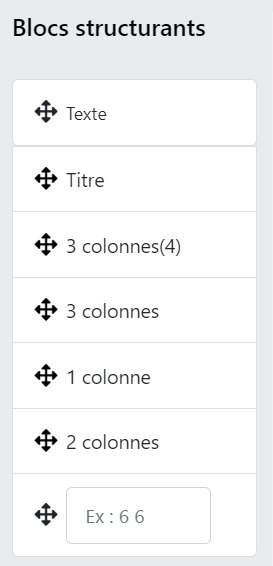
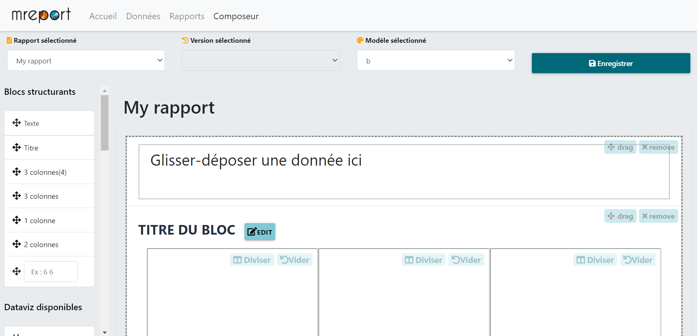
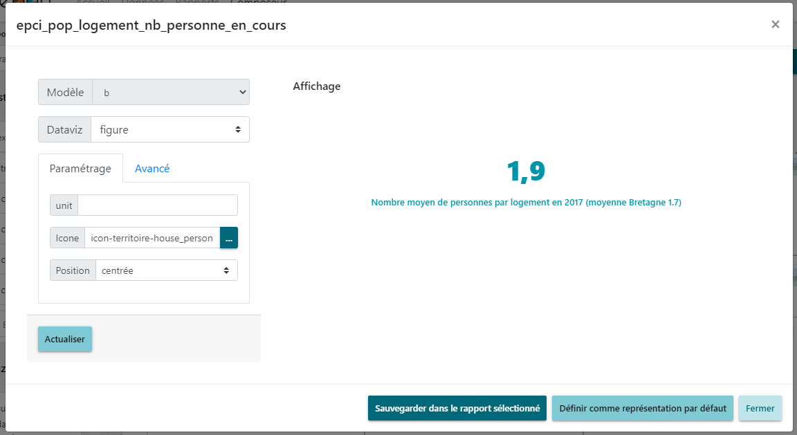

# Interface admin

*Pour montrer au mieux les pages de l'admin nous utilisons les données demo qui sont présent demo.sql*

L'interface admin se décompose en 3 pages:

* Le catalogue 
* Les rapports
* Le composeur

## Catalogue

Dans le catalogue s'affiche chaque jeux de donnée qui se trouve dans rawdata.

Dans le catalogue vous pouvez sélectionner les jeux de données à utiliser dans un rapport

A partir de cette séléction il a possible de créer un nouveau rapport ou d'ajouter ces données à un rapport existant.

ou

Il y a la possibilité de chercher un jeux de données ou de réintisaliser la séléction.

## Rapports

Sur la page rapport nous pouvons voir les rapports qui se trouvent dans la table rawdata. 

Pour un rapport c'est possible de modifier les jeux de données qui le composent

A cette même endroit il ly a les options de supprimer, afficher ou composer le rapport ainsi que le copier.

## Composeur

Dans le composeur il y a deux blocs, la options a gauche et la structuration du rapport sur le reste de la page. 

En ce qui concernce les options il faut dans un premier temps choisir quel rapport utiliser:

Ensuite choisir un modèle de mise en page.

Avec un glisser déposer des élements à gauche, il faut ajouter les blocs qui vont structurer le rapport dans la section princpale.

Une fois la structure ajouté, avec la même action du glisser déposer, ajouter les jeux de données au structure 

Une fois le jeux de données en place il est alors possible de configurer leur affichage en cliquant sur l'engrenage.

Dans la fenêtre qui s'affiche plusieurs options de configuration sont présent. 

Le type défini dans dataviz pour cette exemple est figure, il y a donc des paramètres prédéfinis pour ce type.

Une fois votre rapport structuré avec les données et les dataviz, vous pouvez l'enregistrer et afficher votre rapport ou continuer de le modifier.
